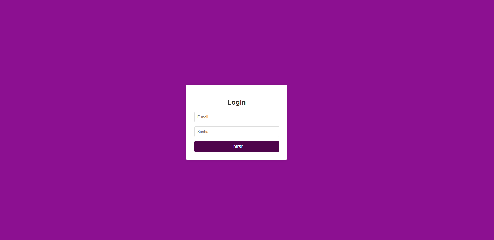
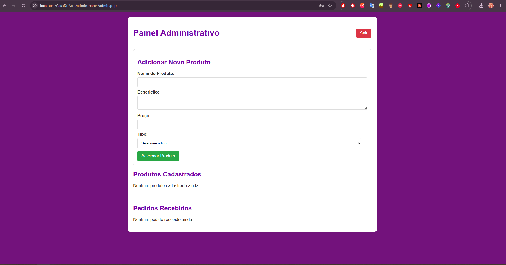

# 🍧 Cardápio Digital - Casa do Açaí
Este projeto é uma solução de cardápio digital desenvolvida especificamente para açaiterias, focada na experiência do usuário e na facilidade de gestão para o administrador.

🚀 Sobre o Projeto
O sistema permite que o cliente navegue pelo cardápio e realize pedidos de forma intuitiva e ágil. Além da interface de vendas, o projeto conta com um Painel Administrativo robusto que permite:

Gerenciamento de Produtos: Adicionar, editar ou remover itens do cardápio com facilidade.

Acompanhamento de Pedidos: Visualização em tempo real das solicitações feitas pelos clientes.

# 🛠 Tecnologias Utilizadas
O projeto foi construído utilizando tecnologias essenciais para o desenvolvimento web dinâmico:

Linguagem: PHP

Banco de Dados: MySQL

Frontend: HTML5, CSS3 e JavaScript

Ambiente de Desenvolvimento: XAMPP (Apache + MySQL)

# 💻 Como Rodar este Projeto
Para executar este projeto localmente, siga estes passos:

Pré-requisitos: Tenha o XAMPP instalado em sua máquina.

Clonar o repositório:

Bash
git clone https://github.com/APShootingStar/CasaDoAcai

Configuração:

Mova a pasta do projeto para dentro do diretório htdocs do seu XAMPP.

Inicie os serviços Apache e MySQL no painel do XAMPP.

Acesse o phpmyadmin e importe o arquivo .sql disponível na pasta do projeto.

Acesso: Abra seu navegador e acesse http://localhost/nome-da-sua-pasta.

# ⚠️AVISO DE SEGURANÇA:

Este projeto foi desenvolvido para fins educacionais e utiliza um banco de dados com dados fictícios. Não utilize este sistema para armazenar informações reais ou sensíveis.

Credenciais de Acesso (Administrador):

Usuário: admin@gmail.com

Senha: admin123
